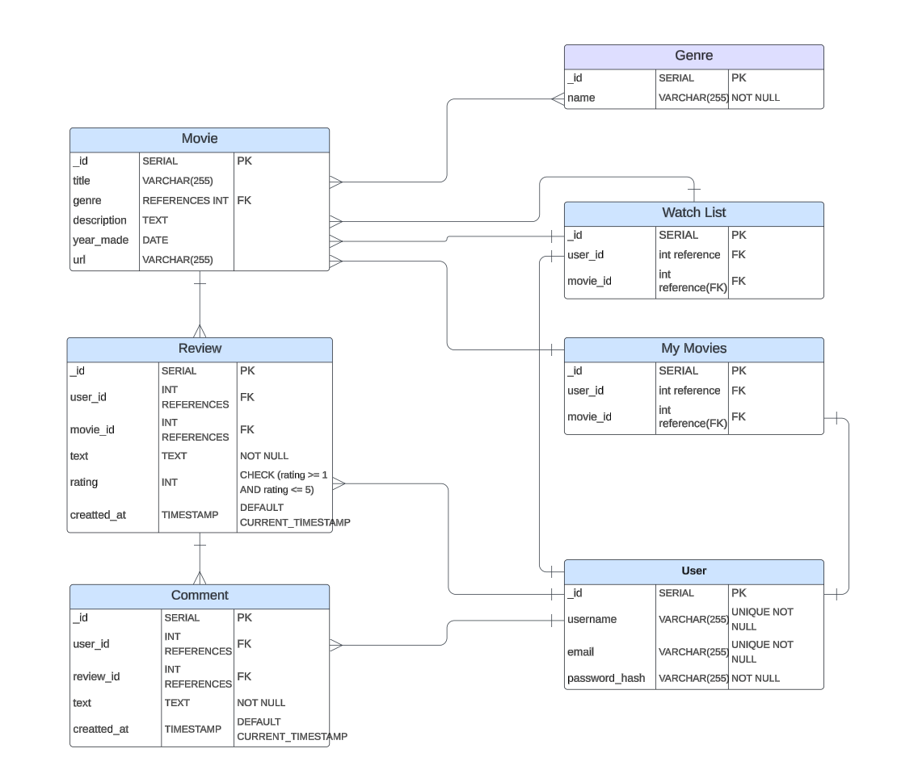
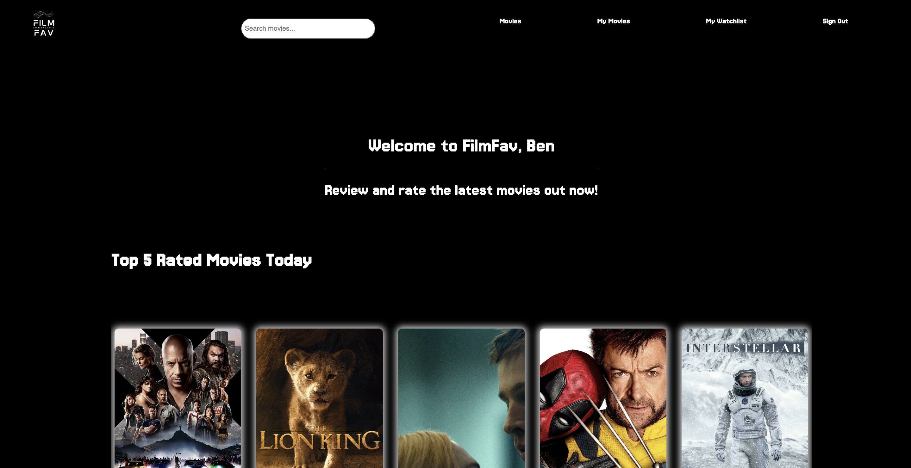
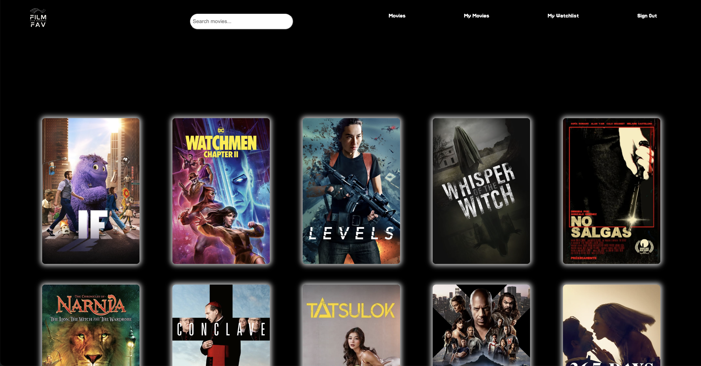
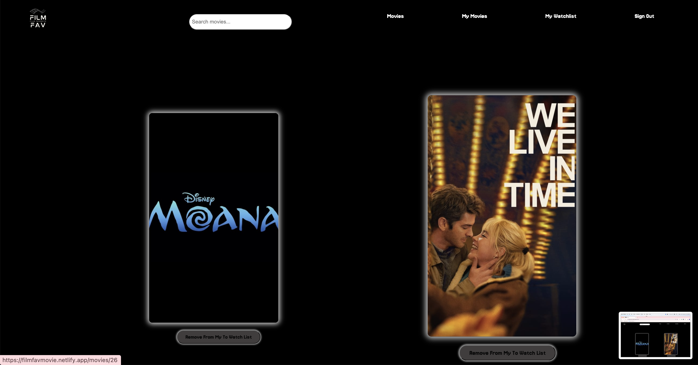
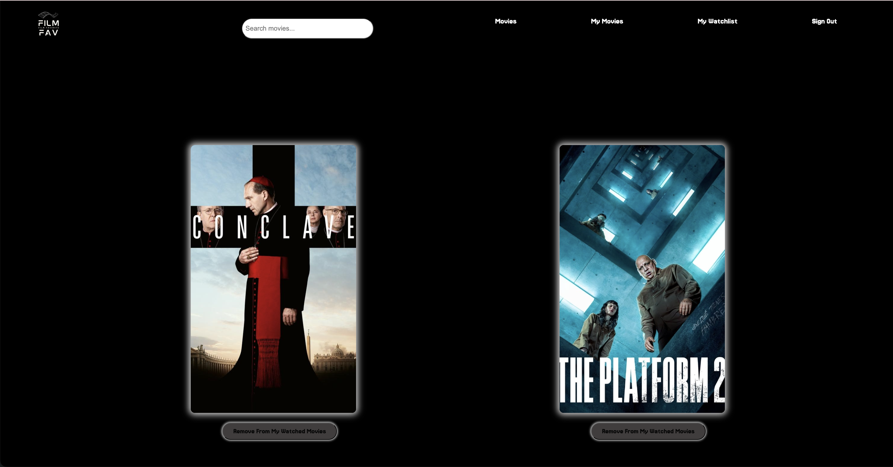

# FilmFav: Social Cinema Review

## Overview
FilmFav is a streamlined movie rating app that helps users discover great films through trusted opinions. By combining personalized ratings with social features, FilmFav creates an engaging platform where movie lovers can share their views and find their next favorite film.

### Smart Rating System
- Rate films with both quick scores and optional mini-reviews.
- Personal Watchlist: Keep track of films to watch and organize your viewing history.
- Quick Find: Easy search movies by name.

### Value Proposition
FilmFav makes it simple to rate movies you've watched and find great recommendations from people whose opinions you trust. Whether you're a casual viewer or film buff, FilmFav helps you discover movies you'll love while connecting with others who share your cinematic interests.

## Deployed Website 
 - Deployed Website: https://filmfavmovie.netlify.app/

## GitHub Repos
- Backend: https://github.com/kevinsubmit/filmfav_backend
- Frontend: https://github.com/bschlo/filmFav-frontEnd

## ERD Diagram

## Components Diagram

.png)

# WireFrame

## Landing Page

## Sign Up

## Sign In

## Dashboard

## Movies

## WatchList

## My Movies

## Routes

### Sign-up
| Action  | Route       | HTTP Verb |
|---------|-------------|-----------|
| Create  | `/user/sign-up`  | POST      |
### Sign-in
| Action  | Route           | HTTP Verb |
|---------|-----------------|-----------|
| Create  | `/user/sign-in` | POST      |

### My Watchlist
| Action | Route               | HTTP Verb |
|--------|---------------------|-----------|
| Index  | `/user/mywatchlist`   | POST       |
| Index  | `/user/mywatchlist/:movie_id`   | Delete     |
---
### My Movies
| Action | Route               | HTTP Verb |
|--------|---------------------|-----------|
| Index  | `/user/mymovies`    | POST       |
| Index  | `/user/mymovies/:movie_id`    | Delete     |
---
### Movies
| Action  | Route                   | HTTP Verb |
|---------|-------------------------|-----------|
| Index   | `/movies`               | GET       |
| Show    | `/movies/:movieId`      | GET       |
---
### Reviews
| Action  | Route                                | HTTP Verb |
|---------|--------------------------------------|-----------|
| Create  | `/movies/:movieId/reviews`          | POST       |
| Get     | `/movies/:movieId/reviews/:reviewId`| GET        |
|Edit     | `/movies/:moviesId/reviews/:reviewId/edit` | PUT |
| Delete  | `/movies/:movieId/reviews/:reviewId`| DELETE     |
---
### Comments
| Action  | Route                                        | HTTP Verb |
|---------|---------------------------------------------|-----------|
| Create  | `/movies/:movieId/reviews/:reviewId/comments`         | POST      |
| Delete  | `/movies/:movieId/reviews/:reviewId/comments/:commentId` | DELETE    |

## Architecture

### Technology Used: 

- Backend: Python and Django
- Frontend: JavaScript, CSS, and React

### Resources Used:

- Stack Overflow, ChatGPT, The Movie Database (TMDB), and GA lesson material.
# filmFav_frontend
# filmFav_frontend2
# filmFav_frontend2
